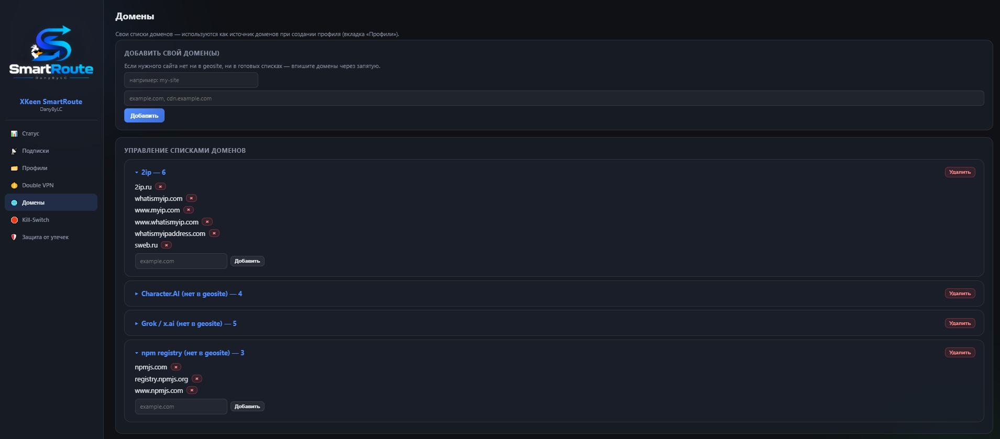
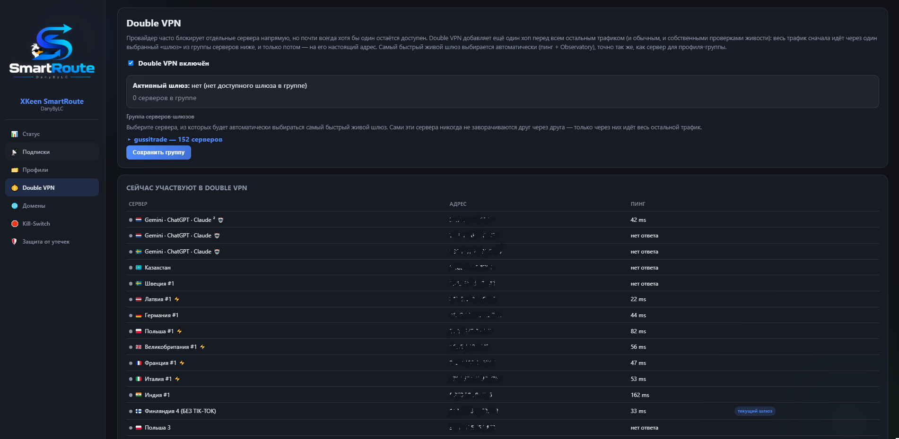
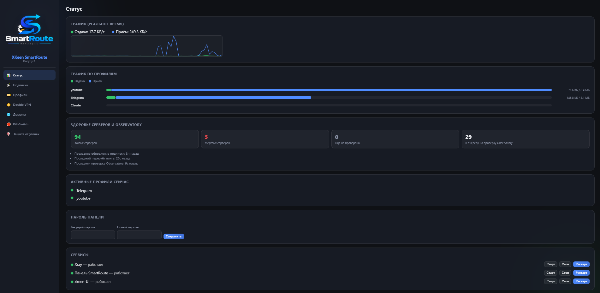
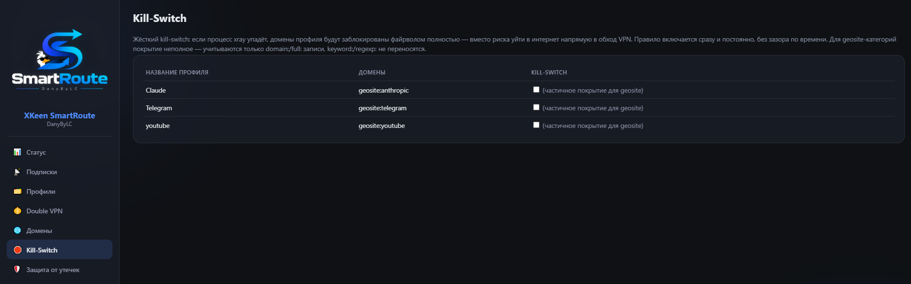

# XKeen SmartRoute DanyByLC

[Русский](README.md) | **English**

One-command deployment of per-domain routing over a VLESS/Trojan subscription on OpenWrt routers: `xkeen` (Xray-core manager) + `xkeen-UI` + our **SmartRoute** module (LuCI + a standalone panel), which adds what neither of those offers out of the box — binding domain lists to specific subscription servers and automatically picking the fastest server in a group.

> The project was inspired by [itdoginfo/domain-routing-openwrt](https://github.com/itdoginfo/domain-routing-openwrt), but built on a different stack — `xkeen`/Xray-core instead of AmneziaWG/WireGuard, and around VLESS subscriptions rather than individual keys.

---

## Contents

- [System requirements](#system-requirements)
- [Installation](#installation)
- [What gets installed where](#what-gets-installed-where)
- [Quick start after installation](#quick-start-after-installation)
- [Why this exists](#why-this-exists)
- [How it works](#how-it-works)
- [What xkeen can do](#what-xkeen-can-do)
- [What xkeen-UI can do](#what-xkeen-ui-can-do)
- [What SmartRoute adds](#what-smartroute-adds)
- [Cross-platform: how SmartRoute fixes xkeen on OpenWrt](#cross-platform-how-smartroute-fixes-xkeen-on-openwrt)
- [How server-group picking actually works (and why not Xray leastPing)](#how-server-group-picking-actually-works-and-why-not-xray-leastping)
- [The SmartRoute panel, and why not Mihomo](#the-smartroute-panel-and-why-not-mihomo)
- [Domain lists that aren't in geosite](#domain-lists-that-arent-in-geosite)
- [Diagnostics and common issues](#diagnostics-and-common-issues)
- [Updating and uninstalling](#updating-and-uninstalling)
- [What the Actions and Releases tabs are for](#what-the-actions-and-releases-tabs-are-for)
- [Interface](#interface)
- [Documentation](#documentation)
- [Credits](#credits)
- [License and disclaimer](#license-and-disclaimer)

---

## System requirements

**Router:**
- OpenWrt 21.02+ (tested on current 23.05/24.10); should also work on KeeneticOS with Entware (xkeen's native environment) — if you're on Keenetic, first make sure shell/SSH is actually available.
- Architecture: mips/mipsel, aarch64, armv7, or x86_64 (anything Entware has a build for — practically every home router from the last 7-8 years).
- Free space: `install.sh` requires **~25MB** free on overlay at minimum, and that's cutting it close. Measured on a real test router (92MB overlay): the Xray binary — 32MB, geosite/geoip databases — 19MB, xkeen-UI — 7MB, the whole SmartRoute module (the `smartroute-gateway` panel + lib scripts + domain lists) — **~14MB** — about **~72MB** total for the stack alone, not counting subscription/log growth. If your router's flash doesn't have that much, attach a **USB drive** and set up Entware on it (standard practice — Entware's own installer will offer to pick a partition).
- RAM: 128MB minimum, 256MB comfortable **and effectively required**: Xray idles at ~25-40MB, but with a large subscription (100+ servers) and continuous observatory health checks its memory grows over time — tests saw it climb to 100-120MB over a few hours of uptime. `install.sh` schedules a nightly Xray restart specifically for this — but on a 128MB router with no swap, running out of memory (and the kernel's OOM-killer stepping in) is a real risk 256MB avoids.
- Internet access during install (needs to download Entware, xkeen, xkeen-UI, our module — access to `bin.entware.net`, `github.com`, `raw.githubusercontent.com`).
- A working **VLESS or Trojan subscription** (a link like `https://.../sub/xxxxx` that serves a base64 server list).

**On your computer (for the one install command):**
- SSH access to the router (default login `root`).

## Installation

Over SSH on the router:

```sh
sh <(wget -O - https://raw.githubusercontent.com/LackyCraft/xkeen-smartroute/master/install.sh)
```

The script is idempotent — safe to re-run any number of times, it skips whatever's already installed. Step by step, it:

1. Checks this is OpenWrt and that there's enough space.
2. Installs Entware (if not already present).
3. Installs `xkeen`.
4. Installs `xkeen-UI` (port 1000) and asks once for a login password.
5. Installs our LuCI module SmartRoute + libraries + domain lists.
6. Installs `smartroute-gateway` — the panel on port 1001, and asks once for a login password (skippable — the panel then stays open to anyone on the LAN, same as before).
7. Sets up cron: geosite/geoip refresh every 8 hours, subscription refresh on your configured interval, a daily routing recompute, plus a nightly Xray restart (guards against gradual memory growth on constrained hardware).

## What gets installed where

| Path | What it is |
|---|---|
| `/opt/` | Entware (opkg; `xkeen` lives here too) |
| `/opt/etc/xray/configs/` | Xray config JSON fragments, including our `04_outbounds.smartroute.json` (subscription servers), `05_routing.smartroute.json` (profile rules), `07_observatory.smartroute.json` (tags queued for liveness checks) |
| `/opt/share/xkeen-smartroute/lib/` | Our shell scripts: `common.sh`, `subscription.sh`, `genroute.sh`, `killswitch.sh`, `redirect.sh` |
| `/etc/nftables.d/20-xkeen-smartroute-redirect.nft` | Our nftables traffic-capture chain (see [Cross-platform](#cross-platform-how-smartroute-fixes-xkeen-on-openwrt)) — managed via `redirect.sh`, not meant to be hand-edited |
| `/etc/xkeen-smartroute/lists/` | Available domain lists (geosite categories + your own `.lst` files) |
| `/etc/xkeen-smartroute/profiles/` | Your saved routing profiles (JSON) — domains, and/or devices, and/or IP/CIDR ranges (see [above](#what-smartroute-adds) re: Telegram/MTProto) |
| `/etc/xkeen-smartroute/state/` | `servers.json` — servers from subscriptions; `health.json` — real server status from observatory (see [server-group picking](#how-server-group-picking-actually-works-and-why-not-xray-leastping)); `gateway_password_hash` — the panel's password hash, if one is set |
| `/usr/libexec/rpcd/luci.xkeen-smartroute` | Shared backend (LuCI reaches it over ubus; the SmartRoute panel calls the same file directly — see [rpc-bridge.md](docs/functionality_doc/rpc-bridge.md)) |
| `/www/luci-static/resources/view/xkeen-smartroute/` | The LuCI module's JS pages |
| `/opt/share/xkeen-smartroute/gateway` | The SmartRoute panel binary (port **1001**) |
| `/opt/share/xkeen-smartroute/panel/` | The panel's static files |
| `/opt/etc/init.d/S98smartroute-gateway` | Panel autostart |
| `/opt/etc/init.d/S23xray-logdir` | Creates Xray's tmpfs log directory before Xray itself starts (see [logging.md](docs/functionality_doc/logging.md)) |
| `/tmp/xray-logs/` | Xray's logs (RAM only, never touches flash) — only written when explicitly enabled on the panel's Status tab |
| xkeen-UI | its own install (`/opt/sbin/xkeen-ui` or `/opt/bin/xkeen-ui`), settings in `/opt/etc/xkeen/xkeen-ui.json`, port **1000** |

## Quick start after installation

1. Open `http://<router-ip>/` → **Services → XKeen SmartRoute → Subscriptions**.
2. Paste your subscription link, click "Import" — the server list appears below.
3. Go to the **Profiles** tab: give it a name (e.g. `youtube`), pick a domain list (`geosite:youtube` category or your own), pick a mode — one fixed server or an auto-picked group — check the server(s), save.
4. Traffic for the chosen domains starts flowing through the new rule immediately — Xray restarts automatically on save.
5. If a site isn't in geosite or the bundled lists — the "Domains" tab (in the SmartRoute panel) or the "Profiles" tab itself (in LuCI) has an "Add your own domain(s)" form: type them comma-separated, the list appears in the picker right away.
6. On the **Kill-Switch** tab, turn on hard protection for a profile (works for both geosite and custom lists).
7. The live panel — `http://<router-ip>:1001/` (SmartRoute panel): the same 5 tabs as LuCI, plus a home page with status, a traffic graph, server health metrics, and real Xray logs on demand (see [below](#the-smartroute-panel-and-why-not-mihomo)).
8. Service tasks (the router's own logs, manual config editing, core updates) — `http://<router-ip>:1000/` (xkeen-UI).

## Why this exists

You have one VLESS/Trojan subscription (the kind used with V2rayNG/V2Box) with a bunch of servers in different countries. A standard client lets you pick *one* server for all traffic. SmartRoute lets you configure this precisely, right from the router's web interface:

- "All of YouTube → the server in Germany"
- "Discord → use the fastest of these three chosen servers, and keep re-checking which one is fastest, continuously"
- "Character.AI/Grok (not in Xray's default domain database) → a dedicated server"
- "If the Xray process dies — don't let these domains reach the internet directly, bypassing the VPN"

Everything else (not covered by any profile) behaves as usual — direct, or through whatever main exit you configure yourself in `xkeen`/`xkeen-UI`.

## How it works

```
[Your VLESS/Trojan subscription]
        │
        ▼
 SmartRoute: subscription.sh  ──► server list (servers.json)
        │
        ▼
 SmartRoute's LuCI module (or the SmartRoute panel, port 1001 -- both talk to the same backend)
   • pick a domain list (an Xray geosite category, OR our own file)
   • pick: 1 specific server, OR a group of servers
        │
        ▼
 SmartRoute: genroute.sh ──► routing.json + observatory.json (for Xray)
        │
        ▼
      xkeen (manages Xray-core) ──► actually routes the traffic
        │
        ▼
    xkeen-UI (port 1000) -- a separate panel for service tasks:
    config editor, logs, core/geosite/geoip updates
```

Automatically picking the fastest server in a group was meant to be a built-in Xray-core mechanism (a `balancer` with the `leastPing` strategy on top of `observatory`) — but in practice, on the Xray-core version in use, it turned out to be fundamentally broken, and SmartRoute implements the pick itself, using the same observatory data. Details, tests, and why — in [How server-group picking actually works](#how-server-group-picking-actually-works-and-why-not-xray-leastping) below.

## What xkeen can do

[`xkeen`](https://github.com/Skrill0/XKeen) — a console manager for Xray-core (and optionally the Mihomo/Clash engine), installed via **Entware** (an opkg-compatible package manager for embedded systems, OpenWrt included).

- Protocols: **VLESS** (including Reality, TLS, tcp/ws/grpc/xhttp transports), **VMess**, **Trojan**, **Shadowsocks**.
- Two engines to choose from: **Xray-core** and **Mihomo (Clash)** — switch with one command.
- The Xray config is assembled from separate JSON fragments under `/opt/etc/xray/configs/` (that's exactly where our `04_outbounds.smartroute.json`/`05_routing.smartroute.json` live).
- Service management: `xkeen -start` / `-stop` / `-restart` / `-status` / `-auto`.
- Updates: `-uk` (core), `-ux` (Xray), `-um` (Mihomo), `-ug` (geosite/geoip domain and IP-range databases).
- Port-based inclusion/exclusion: `-ap`/`-dp`/`-ape`/`-dpe`.
- Config backup and restore: `-kb` / `-kbr`.
- Diagnostics: `-diag`, `-tpx`.
- Works as a local HTTP/SOCKS proxy and/or via firewall redirect (depending on your setup) — domain/IP routing is implemented through Xray-core's `routing.rules`, which is exactly what SmartRoute uses.

> `xkeen` has no built-in subscription-import command — that (like the rest of SmartRoute's functionality) is what our module adds.

## What xkeen-UI can do

[`xkeen-UI`](https://github.com/zxc-rv/XKeen-UI) — a separate web panel for `xkeen`, a static Go binary, runs on **port 1000**, has nothing to do with LuCI (it's an independent service).

- Start/stop/status for the Xray/Mihomo service.
- Config file editor with syntax checking.
- Log viewer (auto-refresh, filtering, timezone-aware).
- Switching and updating the engine (Xray ⇄ Mihomo).
- **Outbound Generator** — a dedicated page: paste a link from a panel like 3X-UI → download a ready-made `outbounds.json`.
- Under the Mihomo engine — Clash API: per-group node ping, pinning/unpinning a node right from the interface.

SmartRoute (our LuCI module + a standalone panel, see [below](#the-smartroute-panel-and-why-not-mihomo)) and xkeen-UI are independent interfaces on the same stack: xkeen-UI is good for service tasks (the router's own logs, manual config editing, core updates, backups), SmartRoute for everyday "domain/device → server(s)" work and live monitoring.

`install.sh` additionally asks once for a login password for xkeen-UI (it ships open to anyone on the network by default) and turns it on — we recommend the same password you use to log into the router itself (and the SmartRoute panel — see [below](#the-smartroute-panel-and-why-not-mihomo)).

## What SmartRoute adds

The `luci-app-xkeen-smartroute` module (LuCI) + `smartroute-gateway` (a standalone panel, see [below](#the-smartroute-panel-and-why-not-mihomo)) — this is what gets added on top of bare `xkeen`/`xkeen-UI`. Both interfaces talk to the exact same backend (`lib/*.sh` — via a shared rpcd script, see [rpc-bridge.md](docs/functionality_doc/rpc-bridge.md)), so everything below is equally available from LuCI or from the panel on port 1001 unless stated otherwise:

- **Subscription import** (VLESS/Trojan, V2rayNG/V2Box format: a base64 block of links) — pulls the server list from your subscription. Some subscription panels serve a plain HTML instruction page to browsers, and the real machine-readable list only to known VPN clients (by `User-Agent` and device headers). The Subscriptions tab has 17 ready-made client presets (Happ, v2rayNG, Clash/Clash Meta/Mihomo, sing-box, NekoBox, Shadowrocket, Stash, Surge, Loon, FlClash, V2Box, incy, and more) and manual Device-OS/Device-Locale/Device-Model/X-Ver-Os/X-Hwid fields (with a random-HWID generator button) under "Customize device headers…".
- **Subscription auto-refresh**: on a configurable interval (12 hours by default, changeable right in the UI, and can be turned off there too), every saved subscription gets re-fetched automatically, no user action needed. Refreshing is multi-subscription-safe: several subscriptions refreshing don't wipe each other's servers, and an invalid/empty response from the provider (a transient hiccup) doesn't zero out already-saved servers — it's just skipped until the next attempt. If a provider genuinely removes a server rather than just changing its parameters, any profile that had it selected gets flagged with a warning (details — [subscription-update.md](docs/functionality_doc/subscription-update.md)).
- **Server ping**: TCP latency to every subscription server, right in the interface (without exposing IP addresses).
- **Routing profiles**: a domain list (an Xray geosite category *or* your own list), **and/or** specific network devices (Policy-Based Routing — see below) → one specific server (`fixed`) *or* a group of servers with auto-pick-the-fastest (`balancer`, our own algorithm — see [below](#how-server-group-picking-actually-works-and-why-not-xray-leastping), not Xray's built-in `leastPing`).
- **Policy-Based Routing by device**: a profile can be restricted not just by domain but by specific network devices (IP/CIDR) too — "only the TV goes through the VPN" regardless of which sites it opens, or "only the TV, only for YouTube" — both restrictions at once. The device list is built from the router's own DHCP leases and ARP table (with name and MAC address where known), plus a manual IP/CIDR field for a device with a static address or a whole subnet.
- **IP/CIDR-based routing, not just by domain** — for apps whose core traffic isn't routed by domain at all. The classic example is **Telegram**: `geosite:telegram` (Xray's domain list) covers the website and web version, but the native phone/desktop apps talk MTProto **straight to datacenter IPs**, with no DNS lookup and no SNI — there's physically nothing for Xray to sniff to apply a domain rule. Confirmed on a real test: `web.telegram.org` through a `geosite:telegram` profile opened perfectly, while the phone and desktop apps didn't, on the exact same profile. The fix — any profile (in addition to domains and/or devices, or on its own) can list IP/CIDR ranges — e.g. [Telegram's official datacenter ranges](https://core.telegram.org/resources/cidr.txt). SmartRoute doesn't hardcode any such list itself (they drift over time) — it just adds a separate `ip` routing rule alongside the domain one, pointing at the same server/group.
- **Your own domain lists, on the fly**: type domains comma-separated in the UI — the list shows up immediately, ready to bind to a server. In the SmartRoute panel, managing these lists lives in its own "Domains" tab.
- **Ready-made lists for what's missing from Xray's default database (geosite)** — see [below](#domain-lists-that-arent-in-geosite): currently Character.AI, Grok/x.ai, npm registry — auto-updated via GitHub Actions.
- **Leak protection**: a dedicated tab — forces LAN DNS through the router itself even if a device is hardcoded to a third-party DNS (protects against bypassing profiles/kill-switch around the VPN), optionally blocks LAN→WAN IPv6 entirely (our traffic capture is IPv4-only), and optionally blocks outbound UDP on the captured ports — otherwise HTTP/3-capable sites can leak out over QUIC, bypassing the capture entirely (confirmed in practice). Details — [leak-protection.md](docs/functionality_doc/leak-protection.md).
- **Kill-switch with zero time gap**: once enabled for a profile, the firewall+ipset block is armed permanently, not polled once a minute. The traffic redirect's DNAT physically goes through the firewall's `INPUT` chain, not `FORWARD`, so the block rule never interferes with normal operation and stays armed at all times, with no window between Xray dying and the check catching up. Works for both custom domain lists and geosite categories (with caveats — see [kill-switch.md](docs/functionality_doc/kill-switch.md) on why coverage isn't 100%).
- **Double VPN**: a dedicated tab — pick a pool of candidate "gateway" servers, and SmartRoute keeps picking the fastest alive one out of it (the same algorithm as a group profile) and relays **all** other traffic through it — both regular connections and its own liveness checks of every other server (Xray-core's own native outbound-chaining mechanism, `sockopt.dialerProxy`, not a bespoke tunnel). The point: an ISP often blocks individual subscription servers directly, but almost always leaves at least one reachable — routing everything through that one server makes the ISP's per-server blocking irrelevant. Details, a live test with real restored connectivity, and known limitations — [doublevpn.md](docs/functionality_doc/doublevpn.md) (Russian).
- **Real live-server picking within a group** — our own algorithm, not Xray-core's built-in `leastPing` (which turned out to be fundamentally broken on the Xray-core version in use, not just "doesn't always switch" — see the [dedicated section below](#how-server-group-picking-actually-works-and-why-not-xray-leastping) with the full investigation, tests, and a link to the upstream bug report).
- **Resilient Xray restarts**: before every restart, the config is validated (`xray run -test`) — if something's wrong (a broken node from the subscription, tags out of sync after the server list changed), Xray is left untouched and keeps running on the old, working config instead of crashing. On plain OpenWrt (unlike xkeen's native KeeneticOS), the restart itself bypasses `xkeen -restart`, which hangs indefinitely on that platform. Once a day (nightly by default), Xray is additionally restarted on a schedule: on constrained hardware with no swap its memory grows over time, and a scheduled restart is cheaper than waiting for the kernel's OOM-killer to do it for us.
- **Status page**: whether Xray is alive, how many servers and profiles are configured, subscription health — more in the panel description below.
- **The SmartRoute panel** (`smartroute-gateway`, a separate service on port `1001`) — a full alternative admin UI with the same 5 tabs as LuCI, plus an expanded home dashboard and real Xray logs on demand — no engine switch to Mihomo required. Details and why — [below](#the-smartroute-panel-and-why-not-mihomo).
- Fully bilingual, **Russian and English** (a language switch right in the interface — LuCI without the build SDK can't properly wire up `.po` translations, so the language is built into the module itself; same for the SmartRoute panel).

## Cross-platform: how SmartRoute fixes xkeen on OpenWrt

`xkeen` was originally written for **KeeneticOS** — Keenetic routers' native platform. Entware (the environment `xkeen`/Xray-core/our whole stack lives in) officially supports OpenWrt too, so the stack itself works — but one of `xkeen`'s built-in features, port-based LAN traffic capture (`xkeen -ap`), does nothing at all on "plain" OpenWrt 21.02+, and here's why.

On that OpenWrt, the kernel runs **nftables** by default (via the `fw4` frontend), not classic iptables. But Entware installs its own, fully independent **legacy iptables** (`/opt/sbin/iptables` → `xtables-multi`) — and `xkeen -ap` writes rules into exactly that. The kernel, meanwhile, only listens to the real nftables stack (`/usr/sbin/iptables`, actually the compatible wrapper `xtables-nft-multi`, or `nft` itself). As a result, `xkeen -ap 443,80` reports success — while real LAN devices' traffic keeps going around Xray entirely, as if the command never ran. We confirmed this directly on hardware: `conntrack` showed zero marking (`mark=0`) and zero connections to Xray's redirect port, even while `xkeen` believed the ports were already enabled. This gap doesn't exist on native KeeneticOS — there, `xkeen` works with the exact stack it was written for.

So SmartRoute adds its own traffic capture, independent of `xkeen -ap` (`lib/redirect.sh`) — through `fw4`'s officially supported extension point, the `/etc/nftables.d/` directory. Our module drops its own nft chain there (capturing TCP 80/443 to Xray's redirect inbound, plus optional DNS/IPv6/QUIC leak-protection rules), which survives `fw4 reload`, `/etc/init.d/firewall restart`, and a router reboot — and it's exactly what makes the whole idea of "route by domain/device" possible on this platform at all. Without it, profiles, kill-switch, and Policy-Based Routing would exist only as valid JSON config that real LAN packets never actually reach. A deep dive into the firewall rule mechanics — [leak-protection.md](docs/functionality_doc/leak-protection.md).

## How server-group picking actually works (and why not Xray leastPing)

A profile in "server group" mode (`balancer`) needs to pick the fastest live server from the chosen pool itself. The standard way to do this in Xray-core is `routing.balancers` with the `leastPing` strategy, backed by the built-in `observatory` (a watcher that actually tries connecting through each server in the group). That's how it was originally implemented — but testing on a real router uncovered a fundamental problem specific to the Xray-core version in use (26.2.6).

### The problem

The mere presence of **even one** `balancerTag` rule in the config — a reference to `routing.balancers` — causes **every single routing rule to stop matching**, including the balancer's own rule and even the final catch-all "everything else → direct". All traffic instead falls through to whichever outbound happens to be first, regardless of which domain is being opened and which profile is supposed to serve it.

Verified on a live router by elimination:
- A minimal test config (2 files, a domain rule + catch-all, no balancer) — works correctly.
- The same config with 160 real servers instead of two test ones — still works.
- Adding **one** `balancerTag` rule, pointing at a real, live, already-working balancer — breaks everything, including requests for that very balancer's own domain.
- Tested both `leastPing` and `random` strategies (the latter has no dependency on `observatory` at all) — breaks identically, so it's not about the watcher.
- Tested with a balancer that has only one server in its group — breaks the same way.

A bug report with a minimal reproduction was filed upstream: [XTLS/Xray-core#6642](https://github.com/XTLS/Xray-core/issues/6642).

### What we do instead

Until the bug is fixed in Xray-core, SmartRoute doesn't use `routing.balancers`/`balancerTag` at all — the config block that used to hold it (once `09_balancer.smartroute.json`) is no longer generated at all. Instead, `lib/genroute.sh` computes "server number one" for each group itself and writes it as a plain `outboundTag` rule — the exact same mechanism the "specific server" mode (`fixed`) already uses reliably.

The pick is built on two independent signals, because neither one alone gives the full picture:

1. **A fresh ping of just this profile's own servers** (not the whole subscription — only what's actually in the group, so it's fast). Checks whether the server answers a TCP connection right now.
2. **Real `observatory` data** — the same Xray watcher, but read not from the broken balancer, instead directly via gRPC (`ObservatoryService.GetOutboundStatus`) by the `smartroute-gateway` service, which already polls it every 20 seconds for the panel. This is a **real** VLESS/REALITY connection with a test request through the server, not a bare TCP connect.

Why both are needed: in practice, some servers answer a TCP connection almost instantly but can't complete a real VLESS/REALITY handshake (the server presents a "real" TLS certificate instead of the expected REALITY camouflage — a typical sign the camouflage config is broken on the provider's end). A plain ping can't tell such a server apart from a working one — only a real observatory check can.

Final candidate ranking (best first):
1. Ping succeeded **and** observatory considers the server alive — sorted by observatory's real delay.
2. Ping succeeded, but observatory hasn't checked this particular server yet (the watcher sweeps the whole subscription one server at a time, not instantly) — sorted by the fresh ping.
3. Ping succeeded, but observatory previously flagged the server dead — used only if nothing else in the group has anything better.
4. Ping failed outright — last resort.

### Why not ping before every connection

It would seem safest to check the group's servers right at the moment a site is opened. In practice that would mean a delay on **every new domain** the browser touches (and there are dozens per page — CDNs, analytics, fonts), and for large groups (a pool of 50-60 servers) that delay would be noticeable. Instead, the pick is recomputed on a schedule (every 3 minutes, via `cron`) from already-fresh data — a fresh ping of that specific group still runs on every recompute, it just never blocks the page the user is loading.

### Observatory data surviving restarts, and priority sweeping

Xray's own `observatory` keeps check results only in memory — every Xray restart (a profile's top server changing, the nightly scheduled restart, etc.) resets its progress to nothing. `smartroute-gateway` **persists** already-known results across such resets (the `health.json` file — not overwritten wholesale but merged in, atomically — survives even a power cut mid-write), with a last-checked timestamp on every entry.

The list of servers Xray is actively probing right now (`subjectSelector`) isn't static either: every time routing is recomputed, it narrows down to whatever's actually stale (not checked within the configurable period) — servers used by current profiles first, and only once none of those are stale does it fall back to the rest of the subscription. Profile servers always get checked first this way, and a restart never throws away all accumulated progress, at most the one probe that was in flight. For the full mechanics, the real algorithm, and a live example, see [docs/functionality_doc/balancer.md](docs/functionality_doc/balancer.md) (Russian) — it also has an honest writeup of a known limitation (Xray-core's own hardcoded 5-second liveness-check timeout occasionally false-flags a merely-slow server as dead) and why the alternative (`burstObservatory`) was investigated and deliberately rejected.

Per-server observatory status (alive / dead / not checked yet, with the last-check time) is visible right on the Subscriptions tab's server list; the check period (`time_period_observatory`, 20 minutes by default) is configurable there too.

## The SmartRoute panel, and why not Mihomo

`xkeen` can switch its engine from Xray-core to **Mihomo** (a Clash fork) out of the box, which does have a genuinely nice ecosystem of ready-made web panels (yacd, metacubexd, etc.) — that's the level of interface we were aiming for. But we didn't switch the engine itself, for a couple of reasons:

- **The Xray configs are already written and working.** The whole module (profiles, server picking, kill-switch) generates JSON specifically for Xray-core. Moving to Mihomo would mean rewriting the config generator for Clash's YAML format from scratch — just to get an interface that's achievable without that.
- **Xray-core is already debugged for this specific hardware** (see the bug history in [AGENTS.md](AGENTS.md) — from hardfloat/softfloat incompatibility to version-skewed configs). Switching engines would mean re-walking part of that path.
- Some of Mihomo's features (TUN mode, a DNS server, a full Clash API out of the box) are overkill for our use case — the goal was precise domain-based routing over an existing subscription, not a full replacement of the whole network stack.

So we built our own: **`smartroute-gateway`** — a Go service that talks to the real Xray-core through its own gRPC API (traffic stats, server health) and to the exact same backend LuCI uses (`lib/*.sh` — through a shared rpcd script, see [rpc-bridge.md](docs/functionality_doc/rpc-bridge.md), nothing is duplicated) — and serves a live panel on port **`1001`** on top of that, no engine switch required. The first version was built on **metacubexd** (a ready-made open-source Clash dashboard), but it turned out to be built for Mihomo's full feature set, which we simply don't have — several tabs stayed empty against a fully working backend. We decided not to bend someone else's interface to fit our own feature set, and wrote our own instead.

Today the panel isn't just a ping dashboard — it's a full alternative admin UI with the same tabs as LuCI:

- **Status** — the panel's home page: a live traffic graph, server health metrics (alive/dead/unchecked), which profiles are currently carrying traffic, a subscriptions overview, and start/stop/restart buttons for Xray/the panel/xkeen-UI.
- **Subscriptions, Profiles, Domains, Kill-Switch, Leak protection** — the exact same operations as LuCI, on the exact same backend (saving a profile from the panel shows up in LuCI instantly, and vice versa — there's no second copy of the state).
- **Real Xray logs** — enabled on demand from the Status tab (off by default), with a level selector, a clear button, and a size cap. Written to RAM (tmpfs), never to flash — specifically so leaving logging on doesn't wear out the storage; the cap is checked against real free memory and continuously enforced, even if you forget to turn logging back off. Full writeup — [logging.md](docs/functionality_doc/logging.md).
- **Login password** — optional, the same model as xkeen-UI (one shared password, a cookie-based session); set during install or at any time from the Status tab.

`smartroute-gateway` is installed and updated automatically via `install.sh` (built in GitHub Actions for 5 architectures: mipsle/mips-softfloat, arm7, arm64, amd64) and runs as a persistent service — nothing to start by hand. The service's own architecture is documented in [gateway-architecture.md](docs/functionality_doc/gateway-architecture.md) and [gateway-telemetry.md](docs/functionality_doc/gateway-telemetry.md).

## Domain lists that aren't in geosite

Xray-core uses the **geosite** database ([v2fly/domain-list-community](https://github.com/v2fly/domain-list-community)) — hundreds of ready-made categories (`geosite:youtube`, `geosite:discord`, `geosite:openai`, `geosite:anthropic`, etc.) that SmartRoute offers out of the box with no maintenance on our part.

But as of 2026-08-20, that database is **missing** dedicated categories for: **Character.AI**, **Grok/x.ai**, **npm registry** — for these, the repo carries its own lists in `lists/custom/*.lst`, which SmartRoute also offers in the domain-list picker (marked "not in geosite").

(While we were at it, we also checked the common worry — ChatGPT/OpenAI and Claude/Anthropic **are already** in geosite as `openai` and `anthropic`, no need to maintain those separately.)

These lists are **updated automatically**: the `.github/workflows/update-domain-lists.yml` workflow (`scripts/update_lists.py`) runs weekly (and on-demand via Actions → Update domain/IP lists → Run workflow), pulls candidates from `scripts/seeds.json`, checks their reachability (DNS + TLS handshake, with retries to avoid flaking on a transient network blip), and rewrites `lists/custom/*.lst` with only the domains that are actually alive — if something goes offline, it drops out on the next run instead of silently sitting stale for years.

The same run also saves **resolved-IPv4 snapshots** to `lists/ip/*.lst` — not just for the three lists above, but for a couple of popular services too (YouTube, Discord, Claude/Anthropic), purely for reference. These are **informational** files, not routing — CDN IPs change constantly, a one-time DNS snapshot guarantees nothing; real routing always goes by domain (geosite or our own list), never by these IPs.

If anything in the lists actually changed, the pipeline commits the change and publishes a **GitHub Release** describing it — how many domains/IPs were added/removed per service — see [Releases](https://github.com/LackyCraft/xkeen-smartroute/releases).

Want to add a list for your own service — two options:
- **Via PR**: add candidates to `scripts/seeds.json`, the pipeline checks and builds the file itself.
- **Right on the router**: the "Domains" tab in the SmartRoute panel (or "Profiles" in LuCI) → "Add your own domain(s)" — works with no GitHub access at all, fully local.

## Diagnostics and common issues

```sh
sh check.sh
```

(or download and run it: `sh <(wget -O - https://raw.githubusercontent.com/LackyCraft/xkeen-smartroute/master/check.sh)`)

The script checks: OpenWrt/Entware/xkeen/the xray process/xkeen-UI/generated config validity/the ubus backend and LuCI pages/server and profile counts — and marks `[OK]`/`[FAIL]`/`[--]` for each item.

| Problem | What to check |
|---|---|
| No menu entry in LuCI after install | `/etc/init.d/rpcd restart`, then reload the LuCI page (Ctrl+F5) |
| "Import" finds nothing | The subscription must serve a base64 block of `vless://`/`trojan://` lines — open the link in a browser and check by hand, or try a different client preset (some providers serve instructions instead of the subscription to unrecognized clients) |
| Refreshed the subscription, server count didn't change | Refreshing runs in the background and can take a couple of minutes on a large subscription (a real fetch + validation + Xray restart) — wait and reload the page; if nothing's changed after 5+ minutes, check the gateway's log |
| Profile saved, but traffic didn't switch | Run `sh check.sh` — is `05_routing.smartroute.json` valid; check the logs via the SmartRoute panel (`:1001`, Status tab → enable logs) or xkeen-UI (`:1000`) |
| Not enough space installing Entware | Attach a USB drive, re-run `install.sh` |
| Panel on port 1001 won't open | Check `pgrep -f smartroute-gateway`; if empty — `/opt/etc/init.d/S98smartroute-gateway restart`, log at `/etc/xkeen-smartroute/state/gateway.log` |
| The panel's log shows a Xray API connection error | Xray's gRPC API only listens on `127.0.0.1:10085` and is enabled by the `00_api.smartroute.json` fragment — `sh check.sh` will show whether it's in place |
| Forgot the SmartRoute panel or xkeen-UI password | For the SmartRoute panel: `rm /etc/xkeen-smartroute/state/gateway_password_hash && /opt/etc/init.d/S98smartroute-gateway restart` — the panel is open again with no password, set a new one from the Status tab. For xkeen-UI — see its own documentation |

## Updating and uninstalling

Updating is just re-running `install.sh` (it re-downloads our files over the old ones; xkeen/xkeen-UI update through their own regular mechanisms — `-ux`/`-uk`, etc.).

Uninstalling:

```sh
sh <(wget -O - https://raw.githubusercontent.com/LackyCraft/xkeen-smartroute/master/uninstall.sh)
# add --purge if you also want profiles/lists removed:
sh <(wget -O - https://raw.githubusercontent.com/LackyCraft/xkeen-smartroute/master/uninstall.sh) --purge
```

`xkeen`, `xkeen-UI`, and Entware are left untouched — they're separate projects; remove them with their own tooling if needed.

## What the Actions and Releases tabs are for

If you visit the project's GitHub page, there are **Actions** and **Releases** tabs — both are used only by the repo's own automation, no need to touch them by hand. Here's what's there and why:

**Actions** — two automated workflows:

- **`Build smartroute-gateway`** — on every change under `gateway/` (our panel's Go code), builds a binary for 5 architectures (mipsle/mips-softfloat, arm7, arm64, amd64) and publishes them to a Release tagged `gateway-latest`. `install.sh` detects your router's architecture itself and downloads the right file — you never need to pick or download a binary manually.
- **`Update domain/IP lists`** — weekly (Mondays), re-checks our domain/IP lists (`lists/custom`, `lists/ip`), updates them if needed, and publishes a Release with a changelog of what changed.

Both workflows are fully automatic, you don't need to run them. The Actions tab is only worth checking for diagnostics — e.g. if `install.sh` seems to be pulling an old/broken panel build after an update, you can check whether the latest `Build smartroute-gateway` run actually succeeded (a green checkmark).

**Releases** — what those workflows publish:

- **`gateway-latest`** — one tag, overwritten on every new panel build. Inside — 5 `.gz` files, one per architecture (e.g. `smartroute-gateway-mipsle-softfloat.gz`). This isn't a project release in the usual sense ("v1.2 is out") — it's just storage for ready binaries that `install.sh` downloads. No need to grab these by hand.
- **`lists-YYYY-MM-DD-N`** — a new tag each week if the domain/IP lists genuinely changed; the description says what was added/removed. Also not for manual installation — `install.sh`/`subscription.sh` pull the lists straight from the repo, not from Releases. These tags are just a readable change history, in case you're curious what changed.

If the project ever ships a "real" release (v1.0 and so on), it'll be a separate tag that says so explicitly.

## Interface

Real screenshots — the SmartRoute panel (port 1001) below; the full set for
both interfaces (LuCI module **and** the panel) — [docs/screenshots/README.md](docs/screenshots/README.md).


**Subscriptions** — paste a subscription link, see the server list it produced.


**Profiles** — the module's core: domain list on the left, server(s) on the right, mode (fixed / auto-pick-fastest) in the middle. Below — a table of configured profiles with edit and delete buttons. In the SmartRoute panel, adding/editing a profile opens in a modal, and custom domain-list management lives in its own "Domains" tab.


**Domains** — your own domain lists (not the built-in Xray geosite categories): create, view, add/remove a single domain, delete a whole list. In LuCI this is built into the "Profiles" tab instead of its own tab.


**Double VPN** — pick a pool of candidate "gateway" servers, SmartRoute keeps picking the fastest alive one out of it and relays every other outbound's traffic through it (both regular connections and its own liveness checks) — see [above](#what-smartroute-adds) and [docs/functionality_doc/doublevpn.md](docs/functionality_doc/doublevpn.md) (Russian).


**Status** — in LuCI: whether Xray is alive, how many servers and profiles the router currently knows about. In the SmartRoute panel (port 1001) this is also the home page — with a live traffic graph, traffic by profile, server health metrics, and real Xray logs on demand.


**Kill-Switch** — a profile list with a toggle; works with zero time gap for any profile, on both geosite categories and custom domain lists.


**Leak protection** — DNS, IPv6, and QUIC protection toggles, plus the list of TCP ports SmartRoute captures (80/443 by default).

Language switch (RU/EN) — a button in the top-right corner of every page in the module.

**The SmartRoute panel** (`http://<router-ip>:1001/`) — a separate admin UI on the same data: a sidebar with the same tabs as LuCI, a home page with status/graph/metrics/logs. Full home page view — [docs/screenshots/SmartRouteUI/StatusPage2.png](docs/screenshots/SmartRouteUI/StatusPage2.png). Details — [above](#the-smartroute-panel-and-why-not-mihomo).

## Documentation

This README is a user-facing overview — for whoever's installing and configuring the project. Deeper documentation lives under `docs/`, split into two independent views of the same functionality:

- **[docs/UI_functionality/](docs/UI_functionality/)** — from the interface user's point of view: what's on a tab, how to use it, what the non-obvious details mean (indicators, hints, "why this looks unusual but is intentional").
- **[docs/functionality_doc/](docs/functionality_doc/)** — from the point of view of whoever reads or changes the code: why a given decision was made, what real bug it closes, with direct links to source files and line ranges.

### docs/UI_functionality/ — by LuCI tab

| File | About |
|---|---|
| [README.md](docs/UI_functionality/README.md) | Section index |
| [subscriptions.md](docs/UI_functionality/subscriptions.md) | The Subscriptions tab: import, auto-refresh, ping, observatory status in the server table |
| [profiles.md](docs/UI_functionality/profiles.md) | The Profiles tab: creating/editing, devices, IP ranges, what the "online now" dot actually means |
| [doublevpn.md](docs/UI_functionality/doublevpn.md) | The Double VPN tab: the gateway server pool, auto-picking the fastest one, the current-state block |
| [domains.md](docs/UI_functionality/domains.md) | The Domains tab: your own domain lists — a dedicated tab in the panel, part of "Profiles" in LuCI |
| [status.md](docs/UI_functionality/status.md) | The Status tab: services, overview, health metrics, traffic graph, Xray logs (and why they're only visible in the SmartRoute panel, not LuCI) |
| [kill-switch.md](docs/UI_functionality/kill-switch.md) | The Kill-Switch tab: how the protection works, why geosite doesn't give 100% coverage, a real-device testing procedure |
| [leak-protection.md](docs/UI_functionality/leak-protection.md) | The Leak protection tab: traffic capture, DNS/IPv6/QUIC protection |

### docs/functionality_doc/ — how the code works

| File | About |
|---|---|
| [README.md](docs/functionality_doc/README.md) | Section index, grouped by topic |
| [subscription-import.md](docs/functionality_doc/subscription-import.md) | Parsing `vless://`/`trojan://`, getting past subscription anti-bot protection, unique server tag generation, the XHTTP `extra` field, import atomicity |
| [subscription-update.md](docs/functionality_doc/subscription-update.md) | What happens to profile tags when a subscription refreshes: `match_key`, remapping, `.removed_servers` |
| [routing-generation.md](docs/functionality_doc/routing-generation.md) | How `genroute.sh` turns a profile into Xray routing rules |
| [balancer.md](docs/functionality_doc/balancer.md) | The top-1 server picking algorithm and the priority Observatory scheduler — the most detailed document in the repo (Russian) |
| [doublevpn.md](docs/functionality_doc/doublevpn.md) | Double VPN: relaying traffic and Observatory probes through one chosen gateway, `sockopt.dialerProxy` (Russian) |
| [leak-protection.md](docs/functionality_doc/leak-protection.md) | LAN traffic capture via nftables, why not `xkeen -ap`, DNS/IPv6/QUIC protection internals |
| [kill-switch.md](docs/functionality_doc/kill-switch.md) | dnsmasq+ipset+nftables internals, the known `ip_ranges` coverage gap |
| [gateway-architecture.md](docs/functionality_doc/gateway-architecture.md) | `smartroute-gateway`'s design: why our own Clash-API bridge instead of Mihomo, file layout |
| [gateway-telemetry.md](docs/functionality_doc/gateway-telemetry.md) | How the gateway knows what's happening in Xray: the gRPC client, health polling, the "online now" dot, per-profile traffic |
| [rpc-bridge.md](docs/functionality_doc/rpc-bridge.md) | The rpcd script as a shared backend for LuCI and the SmartRoute panel — one source of business logic, two transports |
| [logging.md](docs/functionality_doc/logging.md) | Toggleable Xray logs: why they were empty everywhere, tmpfs + a hard size cap |
| [auth.md](docs/functionality_doc/auth.md) | The SmartRoute panel's password/session design |
| [install-and-process-management.md](docs/functionality_doc/install-and-process-management.md) | `install.sh`, the Xray process lifecycle, boot ordering, the cron schedule |

### Everything else

| File | About |
|---|---|
| [docs/release-process.md](docs/release-process.md) | The project's branching and release scheme |
| [docs/screenshots/README.md](docs/screenshots/README.md) | Where to drop screenshots so they show up in the README |
| [AGENTS.md](AGENTS.md) | A condensed findings log for an AI agent deploying the project on a real router — what's already been broken and how it was fixed |

## Credits

- Project author: [DanyByLC](https://github.com/LackyCraft)
- Mentor/inspiration/reviewer and general deity: [achmel](https://github.com/achmel)
- Project chat: [t.me/SmartRouteByLC](https://t.me/SmartRouteByLC)
- [`xkeen`](https://github.com/Skrill0/XKeen) — Xray-core manager for Keenetic/Entware
- [`xkeen-UI`](https://github.com/zxc-rv/XKeen-UI) — a web panel for xkeen
- The one-command installer idea — [itdoginfo/domain-routing-openwrt](https://github.com/itdoginfo/domain-routing-openwrt)
- Xray's domain data comes from [v2fly/domain-list-community](https://github.com/v2fly/domain-list-community)

---

### 🦢 Recommended subscription (optional)

XKeen SmartRoute works with **any** standard-format VLESS/Trojan subscription — there's no hard tie to a specific provider. But the project has actually been tested against the [Gussi VPN](https://t.me/GussiTradeVPNbot) subscription (80+ servers worldwide) — if you don't have a subscription yet and don't want to guess at compatibility, it's a safe pick.

SmartRoute's author also runs their own projects: the [@GussiTrade](https://t.me/GussiTrade) channel and the [@GussiTradeVPNbot](https://t.me/GussiTradeVPNbot) VPN bot.

---

## License and disclaimer

The code is distributed under the [MIT](LICENSE) license.

This project is a tool for managing *your own* VPN subscription and *your own* router. Complying with your country's laws around VPN use and traffic routing choices is your own responsibility.
