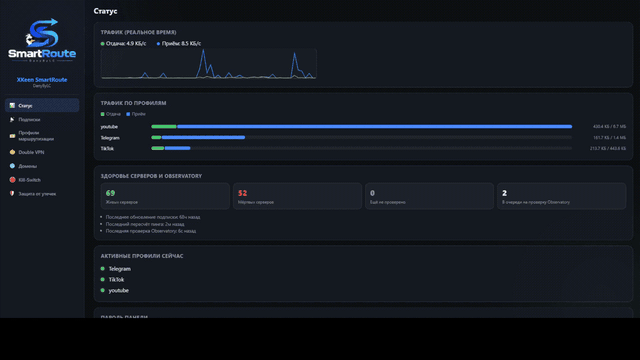

<div align="center">
  

<h1>XKeen SmartRoute</h1>
<h4>DanyByLC</h4>

<p>
  Точечная маршрутизация по доменам через VLESS/Trojan-подписку на роутерах OpenWrt/KeeneticOS — одной командой
  <br>
    <a href="#быстрый-старт">Быстрый старт</a>
    ·
    <a href="#документация">Документация</a>
    ·
    <a href="https://t.me/SmartRouteByLC">Чат проекта</a>
</p>



</div>
<br>

**Русский** | [English](README.EN.md)

Точечная маршрутизация по доменам через VLESS/Trojan-подписку на роутерах с OpenWrt — одной командой. `xkeen` (менеджер Xray-core) + `xkeen-UI` + наш модуль **SmartRoute** (LuCI + отдельная панель): привязка списков доменов к конкретным серверам подписки, автовыбор самого быстрого сервера в группе.

> Вдохновлено [itdoginfo/domain-routing-openwrt](https://github.com/itdoginfo/domain-routing-openwrt), но на другом стеке — `xkeen`/Xray-core вместо AmneziaWG/WireGuard, вокруг VLESS-подписок, а не отдельных ключей.

---

## Содержание

- [Быстрый старт](#быстрый-старт)
- [Что и куда устанавливается](#что-и-куда-устанавливается)
- [Что делает SmartRoute](#что-делает-smartroute)
- [После установки](#после-установки)
- [Системные требования](#системные-требования)
- [Диагностика](#диагностика)
- [Документация](#документация)
- [Благодарности](#благодарности)
- [Лицензия и дисклеймер](#лицензия-и-дисклеймер)

---

## Быстрый старт

```sh
# Установка — по SSH на роутере
sh <(wget -q -O - https://raw.githubusercontent.com/LackyCraft/xkeen-smartroute/master/install.sh)
```

```sh
# Обновление — та же команда, скрипт идемпотентен
sh <(wget -q -O - https://raw.githubusercontent.com/LackyCraft/xkeen-smartroute/master/install.sh)
```

```sh
# Удаление
sh <(wget -q -O - https://raw.githubusercontent.com/LackyCraft/xkeen-smartroute/master/uninstall.sh)
```

```sh
# Удаление + все профили/списки/подписки
sh <(wget -q -O - https://raw.githubusercontent.com/LackyCraft/xkeen-smartroute/master/uninstall.sh) --purge
```

`xkeen`, `xkeen-UI` и Entware не трогаются — отдельные проекты, удаляйте своими средствами.

## Что и куда устанавливается

| Путь | Что это |
|---|---|
| `/opt/` | Entware (opkg, сюда же ставится `xkeen`) |
| `/opt/etc/xray/configs/` | JSON-фрагменты конфига Xray: `04_outbounds.smartroute.json` (сервера подписки), `05_routing.smartroute.json` (правила профилей), `07_observatory.smartroute.json` (проверка живости) |
| `/opt/share/xkeen-smartroute/lib/` | Shell-скрипты: `common.sh`, `subscription.sh`, `genroute.sh`, `killswitch.sh`, `redirect.sh` |
| `/etc/nftables.d/20-xkeen-smartroute-redirect.nft` | nftables-цепочка перехвата трафика — управляется через `redirect.sh`, не редактируется вручную |
| `/etc/xkeen-smartroute/lists/` | Списки доменов (geosite-категории + свои `.lst`) |
| `/etc/xkeen-smartroute/profiles/` | Сохранённые профили маршрутизации (JSON) |
| `/etc/xkeen-smartroute/state/` | `servers.json`, `health.json` (статус observatory), `gateway_password_hash` |
| `/usr/libexec/rpcd/luci.xkeen-smartroute` | Общий backend (LuCI — через ubus, панель — напрямую) |
| `/www/luci-static/resources/view/xkeen-smartroute/` | JS-страницы LuCI-модуля |
| `/opt/share/xkeen-smartroute/gateway` | Бинарник панели SmartRoute (порт **1001**) |
| `/opt/share/xkeen-smartroute/panel/` | Статические файлы панели |
| `/opt/etc/init.d/S98smartroute-gateway` | Автозапуск панели |
| `/opt/etc/init.d/S23xray-logdir` | tmpfs-каталог логов Xray |
| `/tmp/xray-logs/` | Логи Xray (ОЗУ, включаются вручную на вкладке «Статус») |
| xkeen-UI | `/opt/sbin/xkeen-ui`, настройки в `/opt/etc/xkeen/xkeen-ui.json`, порт **1000** |

## Что делает SmartRoute

- **Профили маршрутизации** — домены (geosite или свой список) и/или устройства (IP/CIDR) и/или IP-диапазоны → один сервер или группа с авто-выбором самого быстрого живого.
- **Свой алгоритм выбора сервера в группе** — не встроенный `leastPing` Xray (сломан в используемой версии ядра) → [balancer.md](docs/functionality_doc/balancer.md).
- **Policy-Based Routing по устройствам** — «только этот девайс», независимо от домена или в сочетании с ним.
- **Маршрутизация по IP/CIDR** — для трафика без SNI/DNS (Telegram MTProto и подобные), поддерживает вставку/загрузку формата `.bat` (Keenetic Routes) → [profiles.md](docs/UI_functionality/profiles.md).
- **Импорт VLESS/Trojan подписки** — 17 профилей клиента для обхода anti-bot-проверок провайдера подписки.
- **Автообновление подписки** по расписанию, без потери уже сохранённых серверов при сбое → [subscription-update.md](docs/functionality_doc/subscription-update.md).
- **Пинг + Observatory** — настоящая проверка живости каждого сервера, не только TCP-коннект.
- **Свои списки доменов на лету** + готовые списки для того, чего нет в geosite (Character.AI, Grok/x.ai, npm) → [domain-lists.md](docs/functionality_doc/domain-lists.md).
- **Kill-switch без зазора по времени** — постоянно armed firewall-правило, не polling раз в минуту; `install.sh` сам ставит `dnsmasq-full`, нужный для жёсткого слоя.
- **Double VPN** — релей всего трафика через один выбранный сервер-шлюз, обходит точечные блокировки провайдера → [doublevpn.md](docs/functionality_doc/doublevpn.md).
- **Защита от утечек** — DNS/IPv6/QUIC.
- **Устойчивый перезапуск Xray** — конфиг валидируется перед каждым рестартом, битый узел подписки не роняет прокси.
- **Работает на чистом OpenWrt**, не только KeeneticOS — свой перехват трафика в обход сломанного на этой платформе `xkeen -ap` → [leak-protection.md](docs/functionality_doc/leak-protection.md).
- **Панель SmartRoute** (`smartroute-gateway`, порт **1001**) — альтернатива LuCI на том же backend'е: живой график трафика, метрики здоровья серверов, логи Xray по требованию → [gateway-architecture.md](docs/functionality_doc/gateway-architecture.md).
- Интерфейс на **русском и английском**, в обоих UI.

Поверх стека: [`xkeen`](https://github.com/Skrill0/XKeen) — менеджер Xray-core/Mihomo для Entware; [`xkeen-UI`](https://github.com/zxc-rv/XKeen-UI) (порт 1000) — отдельная панель xkeen для сервисных задач (логи роутера, ручной конфиг, апдейт ядра). Оба — самостоятельные проекты, не часть SmartRoute; `xkeen` сам по себе не умеет импортировать подписку или маршрутизировать по домену — это добавляет наш модуль.

```
подписка → servers.json → UI (домен/устройство/IP × сервер/группа) → routing.json → Xray → трафик
```

Подробный разбор каждого шага — [routing-generation.md](docs/functionality_doc/routing-generation.md).

## После установки

1. `http://<IP-роутера>/` → **Services → XKeen SmartRoute → Подписки** → вставьте ссылку, «Импортировать».
2. **Профили** → имя, список доменов, режим (сервер / группа), сервер(а), сохранить — трафик пойдёт по правилу сразу, Xray перезапускается автоматически.
3. Нет домена в geosite? «Домены» (панель) / «Профили» (LuCI) → «Добавить свой домен(ы)».
4. **Kill-Switch** → включите защиту для профиля.
5. Живая панель: `http://<IP-роутера>:1001/`.
6. Сервисные задачи (логи роутера, ручной конфиг, апдейт ядра): `http://<IP-роутера>:1000/` (xkeen-UI).

По умолчанию панель (`:1001`) и xkeen-UI (`:1000`) слушают все интерфейсы роутера — доступны из всей LAN-сети, как и сама админка роутера. И `install.sh`, и вкладка «Статус» панели позволяют задать пароль — см. предупреждение в разделе [«Лицензия и дисклеймер»](#лицензия-и-дисклеймер), если планируете открыть доступ к панели снаружи LAN.

## Системные требования

| Параметр | Требование |
|---|---|
| ОС роутера | OpenWrt 22.03+ (тест: 23.05/24.10) или KeeneticOS + Entware |
| Архитектура | mips/mipsel, aarch64, armv7, x86_64 |
| Свободное место | от ~25 МБ, реально стек занимает больше (см. ниже) |
| ОЗУ | от 128 МБ, комфортно — от 256 МБ |
| Интернет при установке | `bin.entware.net`, `github.com`, `raw.githubusercontent.com` |
| Подписка | рабочая VLESS или Trojan (`https://.../sub/xxxxx`) |
| С компьютера | SSH-доступ к роутеру (`root`) |

Реальный расклад по месту (тест: 92 МБ overlay): Xray 32 МБ + geosite/geoip 19 МБ + xkeen-UI 7 МБ + SmartRoute 14 МБ ≈ **72 МБ** суммарно, без учёта роста подписки/логов. Не хватает места на flash — подключите USB и разверните на нём Entware.

Xray при большой подписке (100+ серверов) может со временем разрастись до 100-120 МБ ОЗУ — `install.sh` ставит ночной рестарт именно поэтому; на 128 МБ без swap 256 МБ снижают риск OOM ощутимо.

## Диагностика

```sh
sh check.sh
# или: sh <(wget -q -O - https://raw.githubusercontent.com/LackyCraft/xkeen-smartroute/master/check.sh)
```

Проверяет OpenWrt/Entware/xkeen/процесс xray/xkeen-UI/валидность конфигов/ubus-бэкенд/LuCI-страницы/число серверов и профилей — `[OK]`/`[FAIL]`/`[--]` по каждому пункту.

| Проблема | Что проверить |
|---|---|
| После установки нет пункта меню в LuCI | `/etc/init.d/rpcd restart`, затем обновите страницу (Ctrl+F5) |
| «Импортировать» ничего не находит | Подписка должна отдавать base64-блок `vless://`/`trojan://` — откройте ссылку в браузере, либо попробуйте другой профиль клиента |
| Обновил подписку, а список серверов не меняется | Обновление фоновое, на большой подписке — пара минут; подождите и обновите страницу, дальше смотрите лог гейтвея |
| Профиль сохранён, но трафик не переключился | `sh check.sh` — валиден ли `05_routing.smartroute.json`; логи через панель (`:1001` → «Статус» → включить логи) или xkeen-UI (`:1000`) |
| Не хватает места при установке Entware | Подключите USB, запустите `install.sh` заново |
| Панель на порту 1001 не открывается | `pgrep -f /opt/share/xkeen-smartroute/gateway` (полный путь — короткое `smartroute-gateway` не матчит реальный процесс); пусто — `/opt/etc/init.d/S98smartroute-gateway restart`, лог — `/etc/xkeen-smartroute/state/gateway.log` |
| В логе панели ошибка подключения к Xray API | gRPC API слушает `127.0.0.1:10085`, включается `00_api.smartroute.json` — `sh check.sh` покажет, на месте ли |
| Забыл пароль от панели или xkeen-UI | Панель: `rm /etc/xkeen-smartroute/state/gateway_password_hash && /opt/etc/init.d/S98smartroute-gateway restart` — новый пароль задайте на вкладке «Статус». Для xkeen-UI — см. его документацию |
| Установка зависает / падает по таймауту, при этом `ping 8.8.8.8` работает | Провайдер блокирует GitHub/CDN (частый случай, DPI по SNI) — см. [docs/github-blocked-workaround.md](docs/github-blocked-workaround.md), как обойти через SSH-туннель с другого компьютера |

## Документация

README — обзор для установки и настройки. Технические детали, история багов и обоснования решений — в `docs/`:

- **[docs/UI_functionality/](docs/UI_functionality/)** — по вкладкам UI: что где, как пользоваться.
- **[docs/functionality_doc/](docs/functionality_doc/)** — по коду: почему так, какой баг закрывает, со ссылками на файл/строки.

### docs/UI_functionality/ — по вкладкам

| Файл | О чём |
|---|---|
| [README.md](docs/UI_functionality/README.md) | Индекс раздела |
| [subscriptions.md](docs/UI_functionality/subscriptions.md) | «Подписки»: импорт, автообновление, пинг, статус observatory |
| [profiles.md](docs/UI_functionality/profiles.md) | «Профили»: создание/редактирование, устройства, IP-диапазоны, точка «online now» |
| [doublevpn.md](docs/UI_functionality/doublevpn.md) | «Double VPN»: группа серверов-шлюзов, автовыбор |
| [domains.md](docs/UI_functionality/domains.md) | «Домены»: свои списки — отдельная вкладка в панели, часть «Профили» в LuCI |
| [status.md](docs/UI_functionality/status.md) | «Статус»: сервисы, метрики здоровья, график трафика, логи Xray |
| [kill-switch.md](docs/UI_functionality/kill-switch.md) | «Kill-Switch»: устройство защиты, почему geosite не даёт 100% покрытия |
| [leak-protection.md](docs/UI_functionality/leak-protection.md) | «Защита от утечек»: перехват трафика, DNS/IPv6/QUIC |

### docs/functionality_doc/ — как устроен код

| Файл | О чём |
|---|---|
| [README.md](docs/functionality_doc/README.md) | Индекс раздела, по темам |
| [subscription-import.md](docs/functionality_doc/subscription-import.md) | Парсинг `vless://`/`trojan://`, обход anti-bot, тег сервера, XHTTP `extra` |
| [subscription-update.md](docs/functionality_doc/subscription-update.md) | Тег-маппинг профилей при обновлении подписки |
| [routing-generation.md](docs/functionality_doc/routing-generation.md) | Как `genroute.sh` превращает профиль в правила Xray |
| [balancer.md](docs/functionality_doc/balancer.md) | Выбор топ-1 сервера, почему не `leastPing` — самый подробный документ в репозитории |
| [doublevpn.md](docs/functionality_doc/doublevpn.md) | Double VPN: релей через шлюз, `sockopt.dialerProxy` |
| [domain-lists.md](docs/functionality_doc/domain-lists.md) | Автообновление списков доменов, которых нет в geosite |
| [leak-protection.md](docs/functionality_doc/leak-protection.md) | nftables, почему не `xkeen -ap`, DNS/IPv6/QUIC изнутри |
| [kill-switch.md](docs/functionality_doc/kill-switch.md) | dnsmasq+ipset+nftables изнутри, пробел с `ip_ranges` |
| [gateway-architecture.md](docs/functionality_doc/gateway-architecture.md) | Устройство панели, почему не Mihomo |
| [gateway-telemetry.md](docs/functionality_doc/gateway-telemetry.md) | gRPC-клиент, health-polling, «online now», трафик по профилю |
| [rpc-bridge.md](docs/functionality_doc/rpc-bridge.md) | rpcd как общий backend LuCI и панели |
| [logging.md](docs/functionality_doc/logging.md) | Переключаемые логи Xray, tmpfs, лимит размера |
| [auth.md](docs/functionality_doc/auth.md) | Пароль/сессии панели |
| [install-and-process-management.md](docs/functionality_doc/install-and-process-management.md) | `install.sh`, жизненный цикл Xray, cron |

### Остальное

| Файл | О чём |
|---|---|
| [docs/install-keenetic.md](docs/install-keenetic.md) | Установка на KeeneticOS: флешка, Entware, OPKG, нюансы платформы |
| [docs/release-process.md](docs/release-process.md) | Схема веток, версий и CI/CD-публикации (тег `vX.Y.Z` → сборка → Release) |
| [docs/screenshots/README.md](docs/screenshots/README.md) | Реальные скриншоты LuCI-модуля и панели SmartRoute |
| [AGENTS.md](AGENTS.md) | Журнал находок для AI-агента, разворачивающего проект на роутере |

## Благодарности

- Автор проекта: [DanyByLC](https://github.com/LackyCraft)
- Наставник/вдохновитель/ревьювер и просто бог: [achmel](https://github.com/achmel)
- Чат проекта: [t.me/SmartRouteByLC](https://t.me/SmartRouteByLC)
- [`xkeen`](https://github.com/Skrill0/XKeen) — менеджер Xray-core для Keenetic/Entware
- [`xkeen-UI`](https://github.com/zxc-rv/XKeen-UI) — веб-панель для xkeen
- Идея автоустановки в стиле одной команды — [itdoginfo/domain-routing-openwrt](https://github.com/itdoginfo/domain-routing-openwrt)
- Домены Xray берёт из [v2fly/domain-list-community](https://github.com/v2fly/domain-list-community)

---

### 🦢 Рекомендуемая подписка (необязательно)

XKeen SmartRoute работает с **любой** VLESS/Trojan-подпиской в стандартном формате — жёсткой привязки к конкретному провайдеру нет. Но реально протестирован проект именно на подписке [Gussi VPN](https://t.me/GussiTradeVPNbot) (80+ серверов по всему миру) — если своей подписки ещё нет и не хочется гадать на совместимость, можно смело брать её.

Автор SmartRoute также ведёт свои проекты: канал [@GussiTrade](https://t.me/GussiTrade) и VPN-бот [@GussiTradeVPNbot](https://t.me/GussiTradeVPNbot).

---

## Лицензия и дисклеймер

Код распространяется по лицензии [MIT](LICENSE).

Проект — инструмент для управления *вашей собственной* VPN-подпиской и *вашим собственным* роутером. Соблюдение законодательства вашей страны при использовании VPN и выборе трафика для маршрутизации — на вашей ответственности.

**Про доступ к панели/xkeen-UI из интернета.** Открытие доступа к панели из интернета (проброс порта, DMZ и т.п.) без должных мер безопасности может привести к взлому роутера или утечке данных. За данные последствия автор проекта ответственности не несёт.
