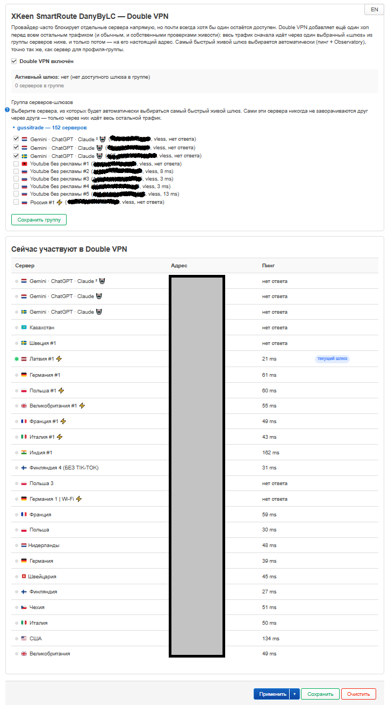

# Вкладка «Double VPN»

Опциональный дополнительный хоп перед всеми остальными outbound'ами:
провайдер часто блокирует отдельные сервера подписки напрямую, но почти
всегда оставляет доступным хотя бы один — весь остальной трафик (и обычные
подключения, и собственные проверки живости других серверов) можно пустить
сначала через один выбранный «шлюз» из группы серверов, и только потом на
его настоящий адрес. Самый быстрый живой шлюз выбирается автоматически, тем
же алгоритмом, что и сервер для профиля-группы. Механика на уровне Xray и
живой тест восстановленной связности — [docs/functionality_doc/doublevpn.md](../functionality_doc/doublevpn.md).

LuCI:

Панель SmartRoute:

## Double VPN включён

Тумблер — отдельное, независимое действие от сохранения группы серверов
ниже. Включить тумблер до того, как в группе сохранён хоть один сервер, —
абсолютно рабочий, ожидаемый порядок действий: пока пул пуст, применять
просто не к чему (см. таблицу «Сейчас участвуют в Double VPN» ниже — при
пустом пуле она честно покажет, что участников нет).

Если применение тумблера реально не удалось на backend — он возвращается
в прежнее положение, и появляется сообщение с настоящей причиной, вместо
того чтобы тихо остаться в состоянии, не совпадающем с реальным (раньше
— реальный найденный баг — панель всегда сообщала об успехе независимо
от исхода).

## Группа серверов-шлюзов

Список серверов, сгруппированный по подписке, сворачиваемый — тот же
компонент, что и выбор серверов на вкладке «Профили». Отмеченные чекбоксом
сервера становятся пулом кандидатов; кнопка «Сохранить группу» сохраняет
именно то, что отмечено, независимо от того, какие группы подписки сейчас
развёрнуты или свёрнуты в момент нажатия (включая сервера, отмеченные в
группе, которую с тех пор свернули, — выбор не теряется).

Если тумблер включён, а в группе не отмечено ни одного сервера — попытка
«Сохранить группу» отклоняется с предупреждением «пул пуст», и ничего не
сохраняется (раньше — реальный найденный баг — предупреждение
показывалось, но сохранение всё равно проходило, оставляя Double VPN
включённым с пустым пулом).

Сами участники группы никогда не заворачиваются друг через друга — только
через выбранного из них шлюза идёт весь **остальной** трафик.

## Сейчас участвуют в Double VPN

Показывает состояние **уже сохранённой и применённой** группы (не
редактируемых чекбоксов выше) — таблица всех серверов, реально сохранённых в
группе: сервер, адрес, пинг, и отметка «текущий шлюз» с точкой «online now»
у того, что прямо сейчас реально выбран как самый быстрый живой (та же
точка и тот же смысл, что на вкладке «Профили» — реальный трафик через этот
outbound прямо сейчас, не просто "выбран"). Если ни у одного сервера нет
отметки «текущий шлюз» — либо функция выключена, либо в группе сейчас нет ни
одного достижимого сервера; в обоих случаях трафик остаётся прямым, без
цепочки, а не блокируется. Пустая группа показывает явное «группа пуста»
вместо таблицы. Обновляется каждые 3 секунды, пока вкладка открыта.

Применение изменений (выбор нового шлюза, реакция на выключение/включение)
происходит на следующем пересчёте маршрутизации — до 3 минут по расписанию
cron, либо сразу же при сохранении тумблера/группы через интерфейс.

## Сервер пропал при обновлении подписки

Если провайдер при обновлении подписки поменял узел настолько, что у него
сменился тег (типичный случай — тот же физический сервер, провайдер
подкрутил один query-параметр) — SmartRoute сам переносит его в группе на
новый тег, ничего делать не нужно. Если сервер пропал по-настоящему —
под таблицей появляется красное предупреждение с именем(ами) пропавших
серверов, тем же паттерном, что и на вкладке «Профили». Сам пропавший тег
при этом уже удалён из группы (в отличие от предупреждения — оно
остаётся, пока группу не пересохранят через «Сохранить группу», даже если
это будет тот же самый набор серверов). Механика — [docs/functionality_doc/doublevpn.md](../functionality_doc/doublevpn.md#ремап-тегов-пула-при-обновлении-подписки).
