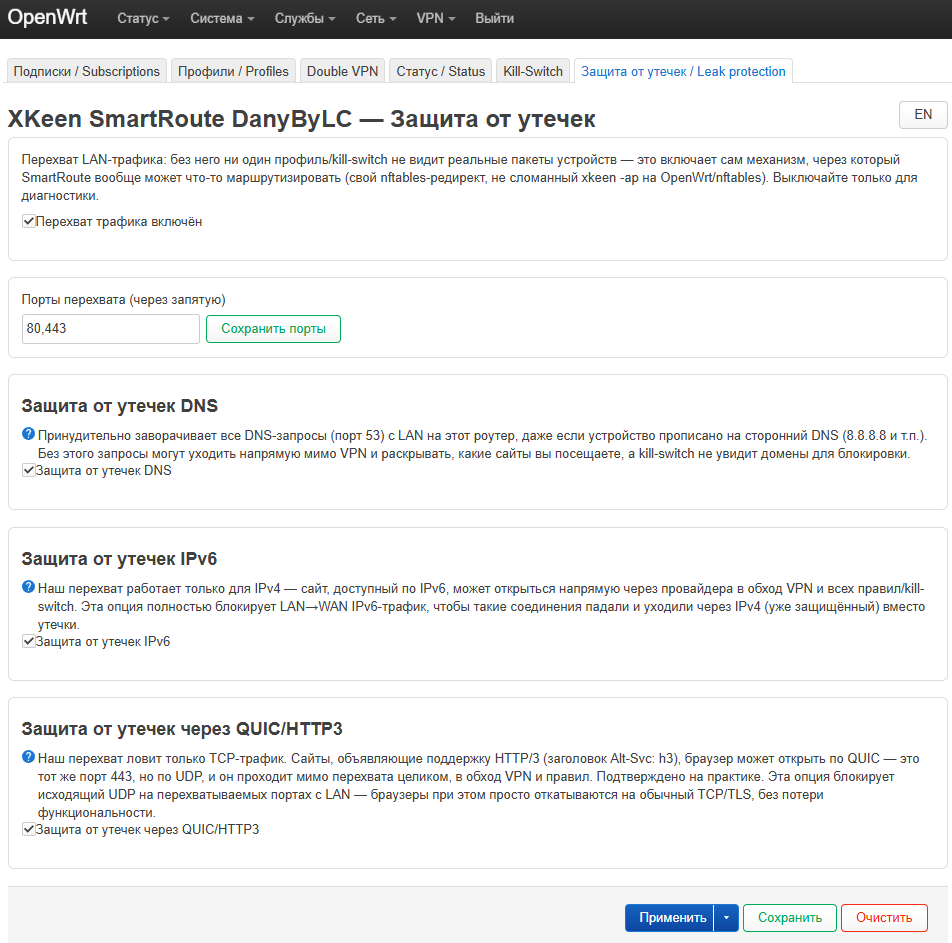
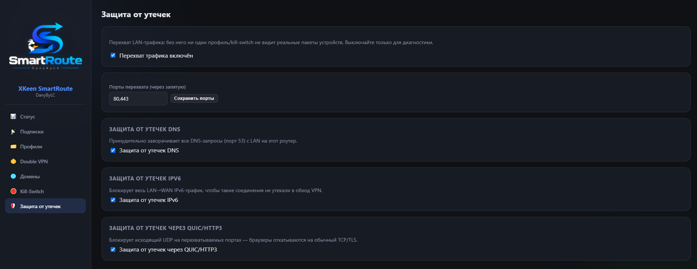

# Вкладка «Защита от утечек» / Leak protection

Четыре независимых переключателя, от базового механизма перехвата до
защиты от конкретных путей обхода VPN.

LuCI:

Панель SmartRoute:

## Перехват LAN-трафика

Включено/выключено + список перехватываемых портов (по умолчанию
80,443). Это базовый механизм — без него ни один профиль или kill-switch
вообще не видит трафик устройств: собственная `nftables`-цепочка
SmartRoute (не сломанный `xkeen -ap` на чистом OpenWrt/nftables — см.
README, раздел «Кроссплатформенность»). Выключать стоит только для
диагностики — с выключенным перехватом ни один профиль физически не
маршрутизирует ничего.

## Защита DNS

Принудительно заворачивает все DNS-запросы (порт 53) с LAN на сам
роутер, даже если устройство прописано на сторонний DNS (8.8.8.8 и
т.п.). Без этого:
- Запросы могут уходить напрямую мимо VPN, раскрывая, какие сайты вы
  посещаете, ещё до того, как соединение вообще началось.
- Kill-switch (жёсткий режим) не увидит домены для блокировки — его
  механизм и так завязан на то, что DNS-запросы проходят через роутер
  (см. [docs/UI_functionality/kill-switch.md](kill-switch.md)).

Не защищает от DNS-over-HTTPS/DoT (шифрованный DNS поверх порта 443,
физически не совпадает с портом 53) — устройство может резолвить домены
в обход этого механизма, если явно настроено на DoH/DoT-резолвер. Это
известный, пока не закрытый пробел — см. раздел «Как приблизиться к 100%»
в документе про Kill-Switch.

## Блокировка IPv6

Наш перехват трафика работает только для IPv4 — сайт, доступный по IPv6,
мог бы открыться напрямую через провайдера в обход VPN и всех правил.
Опция полностью блокирует LAN→WAN IPv6-трафик, чтобы такие соединения
падали и уходили через IPv4 (уже защищённый) вместо утечки.

## Блокировка QUIC/HTTP3

Наш перехват ловит только TCP-трафик. Сайты с заголовком `Alt-Svc: h3`
браузер может открыть по QUIC — тот же порт 443, но по UDP, который
проходит мимо перехвата целиком, в обход VPN и правил (подтверждено на
практике). Опция блокирует исходящий UDP на перехватываемых портах с
LAN — браузеры при этом просто откатываются на обычный TCP/TLS, без
потери функциональности.
