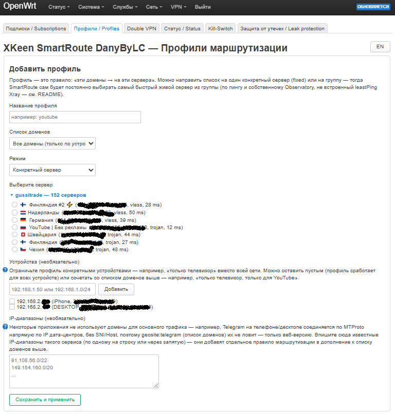
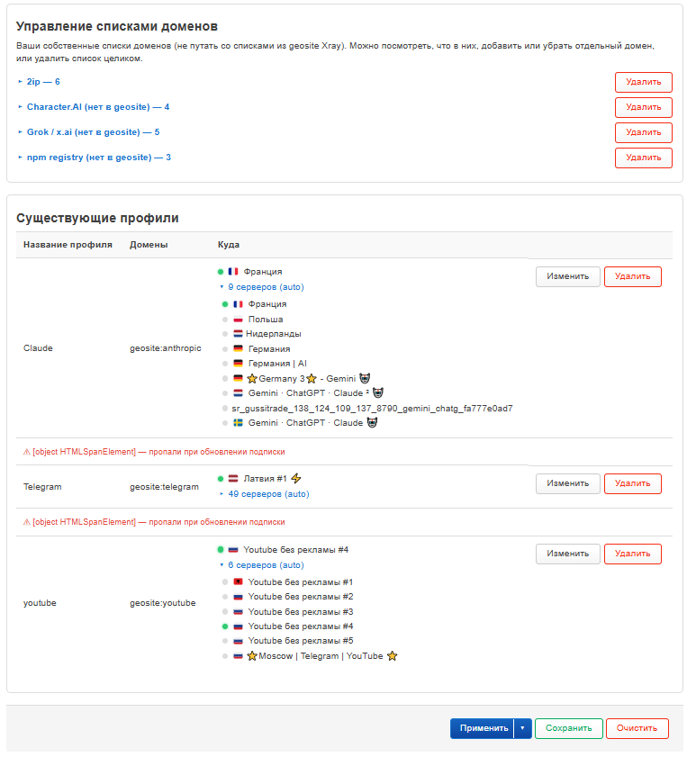
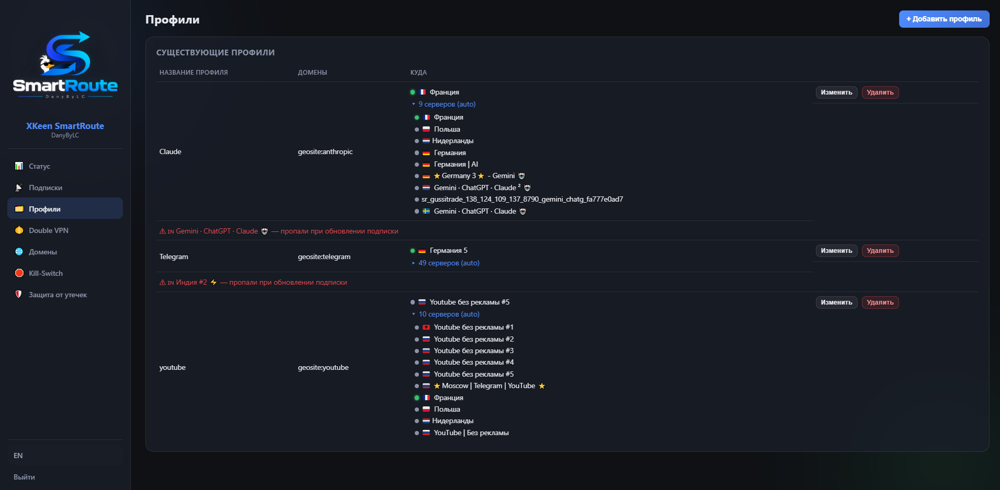

# Вкладка «Профили» / Profiles

Создание и редактирование профилей маршрутизации: какие домены/устройства
идут через какой сервер (или группу серверов с авто-выбором).

LuCI — форма добавления профиля:


## Создание профиля

- **Имя** — произвольное, уникальное в пределах установки.
- **Источник доменов**:
  - «Любой» — без ограничения по домену (актуально, если ограничиваете
    только по устройству или по IP-диапазону ниже).
  - Geosite-категория Xray (готовый список: youtube, discord, telegram и
    т.д., плюс наши дополнительные — Character.AI, Grok/x.ai, npm — см.
    README, раздел «Списки доменов, которых нет в geosite»).
  - Свой список (см. «Управление списками доменов» ниже).
- **Устройства (Policy-Based Routing)** — необязательно: ограничить
  профиль конкретными устройствами сети, а не всей LAN. Чекбоксы по
  устройствам, обнаруженным через DHCP-аренды и ARP-таблицу роутера (имя +
  MAC, если известны), плюс поле для ручного ввода IP/CIDR — для
  устройства со статическим адресом или целой подсети. Можно сочетать с
  доменами («только телевизор, только для YouTube») или оставить только
  устройства без доменов («весь трафик этого устройства»).
- **IP-диапазоны** — необязательно: для приложений, чей основной трафик не
  резолвится по домену (классика — Telegram: нативные приложения ходят по
  MTProto напрямую на IP дата-центров, `geosite:telegram` ловит только
  веб-версию). Список IP/CIDR через запятую или с новой строки, каждый
  добавляет отдельное правило маршрутизации в дополнение к доменному.
  Подробности и живой пример — [routing-generation.md](../functionality_doc/routing-generation.md).

  **Поддерживается формат `.bat` (Keenetic Routes)** — те же строки, что
  Keenetic отдаёт при экспорте статических маршрутов:

  ```
  route ADD 147.75.208.0 MASK 255.255.240.0 172.16.0.2
  route ADD 185.89.216.0 MASK 255.255.252.0 172.16.0.2
  route ADD 31.13.24.0 MASK 255.255.248.0 172.16.0.2
  ```

  Вставьте текст прямо в поле, или нажмите **«Загрузить .bat»** и выберите
  файл — содержимое допишется в конец поля, замыкающий IP (адрес шлюза у
  Keenetic) распознаётся и просто игнорируется, конвертация в CIDR
  происходит автоматически при сохранении. Формат определяется построчно,
  так что можно свободно мешать `.bat`-строки с обычными CIDR в одном поле.
  Если строка похожа на `route ADD ...`, но с кривым IP или маской — при
  попытке сохранить профиль появится ошибка с указанием, какая именно
  строка не распозналась (само сохранение при этом не пройдёт, пока список
  не станет валидным).

  Готовые списки диапазонов сервисов в этом формате массово гуляют в
  сети — поищите **«.bat CIDR address for Keenetic»**. Собрать список
  самому — реально (резолвить домены сервиса, найти его официальные
  CIDR-подсети), но проще и надёжнее взять готовое решение:

  - [rekryt/iplist](https://github.com/rekryt/iplist) — автоматически
    собирает и обновляет диапазоны под конкретный сервис по запросу; у
    проекта есть сайт, откуда можно сразу скачать готовые списки.
  - [shlima/keenetic-antifilter](https://github.com/shlima/keneetic-antifilter) —
    уже готовые списки на популярные сервисы, ничего собирать не нужно.
- **Режим**:
  - **Конкретный сервер** — один статический выбор из пула.
  - **Группа (авто-выбор)** — балансировщик сам выбирает самый быстрый
    живой сервер из отмеченных, пересчитывается на каждом regen (раз в 3
    минуты) — подробности и почему не встроенный `leastPing` Xray — [docs/balancer.md](../functionality_doc/balancer.md).
- **Выбор серверов** — список серверов, сгруппированный по подписке,
  сворачиваемый. Для «конкретного сервера» — выбор одного (радио); для
  «группы» — чекбоксы (пул кандидатов для авто-выбора).

Профиль обязан ограничивать хоть чем-то одним: доменом, устройством или
IP-диапазоном — иначе он перехватил бы вообще весь трафик со всех
устройств, что почти наверняка не то, что имелось в виду. Сохранение с
пустым набором ограничений отклоняется с понятной причиной.

## Таблица существующих профилей

LuCI — таблица + управление списками доменов:


Панель SmartRoute:


- **Домены** — что выбрано (geosite-категория / свой список / «любой»),
  плюс отметки 📱 (устройства) и 🌐 (IP-диапазоны), если заданы.
- **Целевой сервер**:
  - Для «конкретного сервера» — имя сервера + зелёная точка «online now».
  - Для «группы» — в свёрнутом виде показан **только** реально выбранный
    сейчас балансировщиком сервер (с его точкой); разворачивается в
    список «▾ N серверов (auto)» — весь пул кандидатов, у каждого своя
    точка.

### Точка «online now» — что она реально означает

Показывает, идёт ли через этот **конкретный** сервер прямо сейчас
настоящий трафик — источник данных: реальные байтовые счётчики Xray
(`StatsService`, опрашиваются гейтвеем каждые 3 секунды), **не**
Observatory. В свёрнутом виде строка профиля показывает ровно тот сервер,
через который физически идёт ваш трафик прямо сейчас — это буквальный
ответ на "через какой сервер я сейчас смотрю YouTube".

Нюанс для развёрнутого вида: Observatory сама периодически шлёт
мини-запрос через **каждого** кандидата пула для проверки живости — это
тоже настоящий трафик через тот outbound, так что точка неиспользуемого
сейчас кандидата может на мгновение мигнуть зелёным именно поэтому, а не
потому что через него тоже идёт ваш трафик.

### Красное предупреждение под строкой профиля

Появляется, если при последнем обновлении подписки какой-то сервер из
пула этого профиля пропал без замены (провайдер реально удалил его — не
просто сменил параметры). Показывает имя и когда пропал. Пропадает само
при следующем сохранении профиля через UI. Полный механизм — [docs/subscription-update.md](../functionality_doc/subscription-update.md).

## Управление списками доменов

В панели SmartRoute это отдельная вкладка «Домены», не часть «Профили» —
см. [domains.md](domains.md).

- **Создать новый список** — имя + домены через запятую (сразу
  становится доступен как источник доменов для профилей). Домены
  санитизируются на лету (вставили `https://2ip.ru/path` — сохранится
  `2ip.ru`, с уведомлением, что именно изменилось).
- **Существующие списки** — сворачиваемые карточки: посмотреть домены,
  добавить/удалить отдельный домен, удалить список целиком (с
  подтверждением).

## Редактирование профиля

Кнопка «Изменить» подгружает все поля профиля обратно в форму создания
(включая уже выбранные сервера, устройства, IP-диапазоны) — сохранение
перезаписывает профиль с тем же именем.
