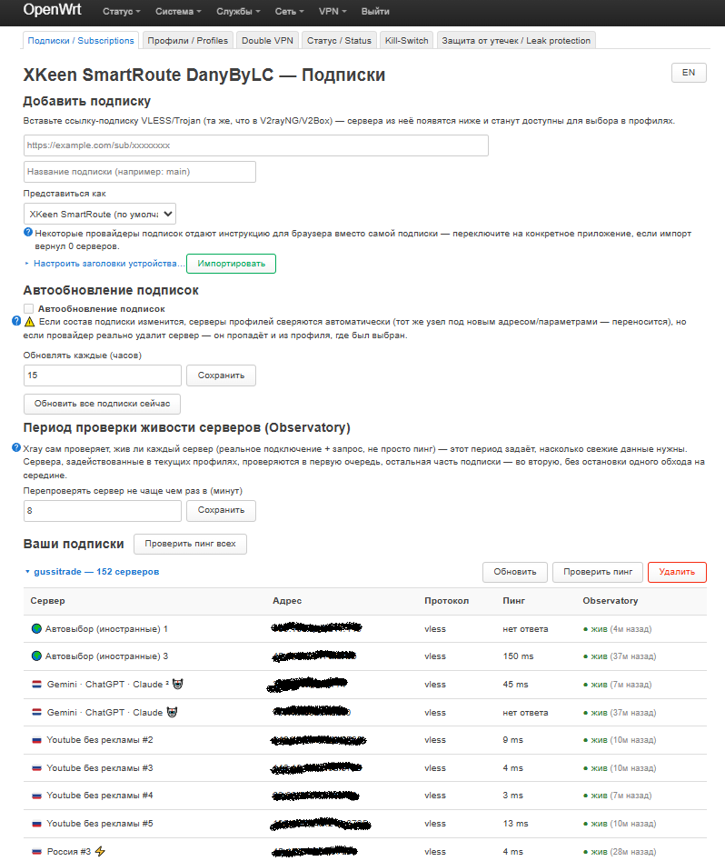
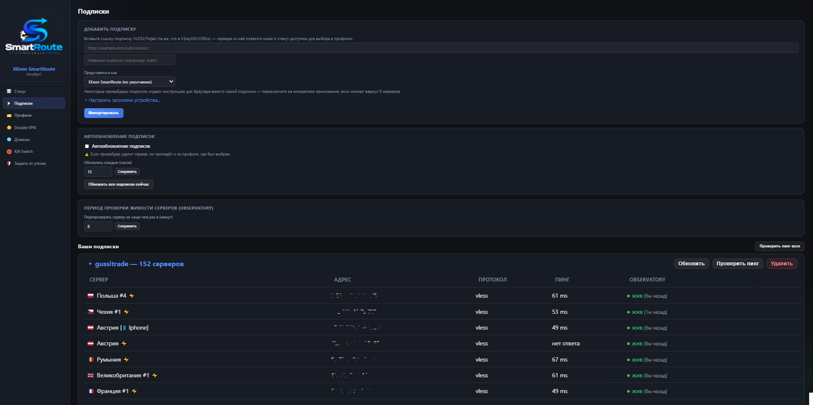

# Вкладка «Подписки» / Subscriptions

Импорт VLESS/Trojan-подписок, список серверов, пинг, статус Observatory,
настройки автообновления.

LuCI:

Панель SmartRoute:

## Добавление подписки

- **Ссылка** — обычная подписка (base64-блок `vless://`/`trojan://`
  ссылок, тот же формат, что в V2rayNG/V2Box).
- **Название** — произвольный ярлык, используется как префикс тегов
  серверов этой подписки (`sr_<label>_...`) и для последующего
  автообновления/удаления именно этой подписки.
- **Профиль клиента** — 17 готовых пресетов (Happ iOS/Android, v2rayNG,
  Clash/Clash Meta/Mihomo, sing-box, NekoBox, Shadowrocket, Stash, Surge,
  Loon, FlClash, V2Box, incy, и др.) + свой (`smartroute`, представляется
  честно). Нужно потому, что некоторые панели подписок отдают браузеру
  просто HTML-страницу с инструкцией, а настоящий список серверов — только
  запросам, похожим на известный VPN-клиент (по `User-Agent` и заголовкам
  устройства).
- **Настроить заголовки устройства…** (сворачиваемый блок) — ручное
  переопределение отдельных полей пресета: Device-OS, Device-Locale,
  Device-Model, X-Ver-Os, X-Hwid (с кнопкой генерации случайного HWID).
  Любое поле можно оставить пустым — тогда используется значение из
  выбранного пресета.

## Список серверов подписки

Сворачиваемый список на каждую подписку, колонки:

- **Сервер** — отображаемое имя из ссылки подписки.
- **Адрес** — `host:port` (реальный IP не публикуется отдельно, только в
  этом поле).
- **Протокол** — `vless`/`trojan`.
- **Пинг** — TCP-задержка до сервера (кнопка «Пинг» — по всем серверам
  подписки разом, параллельно).
- **Observatory** — статус живости из реальной проверки Xray (не просто
  TCP, а полноценное VLESS/REALITY-соединение + HTTP-запрос) — зелёная
  точка «жив», красная «мёртв», серая «не проверен», с указанием, когда
  проверено. Подробный разбор механики — [docs/balancer.md](../functionality_doc/balancer.md).

  **Нюанс**: несколько серверов часто показывают "проверено только что"
  одновременно — это не глюк. `checked_at` — это момент, когда наш
  гейтвей **в последний раз опросил** внутреннюю таблицу Xray (раз в 20
  секунд), а не момент, когда именно этот сервер был реально перепроверен
  — гейтвей штампует текущим временем всё, что видит в таблице разом.
  Сам факт «жив»/«мёртв» при этом достоверен, просто "только что" не
  всегда значит "только что физически проверено".

## Автообновление подписок

- **Галочка «Автообновление подписок»** — включает/выключает
  периодическое обновление по расписанию. По умолчанию включено.
  Выключает только автоматический (cron) путь — кнопка «Обновить сейчас»
  работает всегда, независимо от галочки.
- **Предупреждение рядом** — если состав подписки поменяется, теги
  серверов профилей сверяются автоматически (тот же узел под новым
  адресом/параметрами — переносится молча), но если провайдер реально
  удалит сервер — он пропадает и из профиля, где был выбран (с красной
  пометкой в профиле). Полный механизм — [docs/subscription-update.md](../functionality_doc/subscription-update.md).
- **Интервал (часов)** + кнопка «Сохранить».
- **«Обновить все подписки сейчас»** — принудительное немедленное
  обновление в фоне, независимо от расписания и от галочки автообновления.

## Период проверки Observatory

- **«Перепроверять сервер не чаще чем раз в (минут)»** — порог
  устаревания, после которого сервер снова попадает в очередь на
  проверку Observatory. По умолчанию 20 минут. Приоритет — сначала
  протухшие сервера из активных профилей, потом остальная подписка (см.
  [docs/balancer.md](../functionality_doc/balancer.md)).

## Удаление подписки

Кнопка с подтверждением — удаляет саму подписку и все её сервера/аутбаунды
из конфига. Профили, ссылавшиеся на удалённые сервера, не удаляются
целиком, но теряют эти конкретные сервера из пула (аналогично тому, как
это работает при обычном обновлении — см. [docs/subscription-update.md](../functionality_doc/subscription-update.md)).
